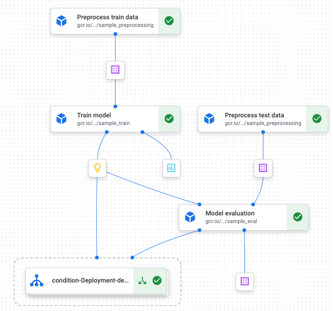

# Demo of Kubeflow pipeline on GCP

## Overview
One non-ML related kubeflow pipelines example:

- Main notebook: ```kubeflow_gcp_core_ideas.ipynb ```

Two ML related kubeflow pipelines examples:

1. Notebook based, standalone python solution.

    - Main notebook: ```kubeflow_gcp_from_notebook.ipynb ```
    - Procedure: Run the notebook from the top

2. Container based, solution:

    - Main notebook: ```kubeflow_gcp_from_components.ipynb ```
    - Components: ```component_based/ ```
    - Procedure: Build and push docker image to GCP ```build_image.sh``` for each component, and run the main notebook from the top

## Pre-requisite
1. Setup Python environtment (Python3.10.10)

```console
python3 -m venv ~/YOUR_PY_ENV
source ~/YOUR_PY_ENV/bin/activate
```

2. Install required packages (inc. ``` kfp, google-cloud components ```)

3. Setup environment variables inc. (NB: Credentials file can be created and downloaded from your GCP console)

```console
export $PROJECT_ID
export $GOOGLE_APPLICATION_CREDENTIALS
```

4. Setup service account on your GCP console

5. Download file from Kaggle
- https://www.kaggle.com/c/house-prices-advanced-regression-techniques

6. Install Google cloud SDK on your machine


## Pipeline overview

